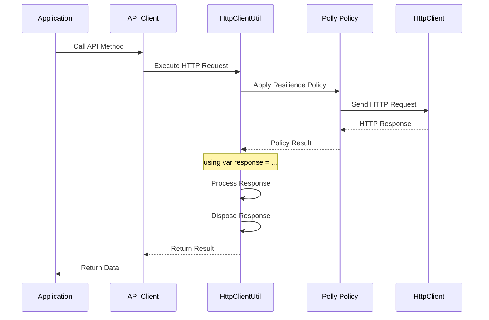

# 🏗️ Azure DevOps API Client - Architecture Documentation

## 📋 Overview

This document outlines the architectural decisions, patterns, and design principles used in the Azure DevOps API Client library.

## 🎯 Design Principles

### 1. **Simplicity Over Complexity**
- ✅ Use .NET built-in features instead of reinventing the wheel
- ✅ Leverage `HttpClient` and `IHttpClientFactory` directly
- ✅ Avoid unnecessary abstractions and wrappers
- ❌ No custom memory management when .NET handles it well

### 2. **Proper Resource Management**
- ✅ Implement `IDisposable` correctly where needed
- ✅ Use `using` statements for automatic disposal
- ✅ Proper `HttpResponseMessage` disposal in all HTTP operations
- ✅ Support both direct `HttpClient` and `IHttpClientFactory` patterns

### 3. **Resilience and Reliability**
- ✅ Built-in retry policies using Polly
- ✅ Circuit breaker patterns for fault tolerance
- ✅ Configurable timeout and retry strategies
- ✅ Graceful error handling and logging

## 🏛️ Architecture Overview

```
┌─────────────────────────────────────────────────────────────┐
│                    Consumer Application                      │
├─────────────────────────────────────────────────────────────┤
│                  Azure DevOps API Client                    │
│  ┌─────────────────┐  ┌─────────────────┐  ┌──────────────┐ │
│  │   Core API      │  │   Teams API     │  │ Operations   │ │
│  │   Client        │  │   Client        │  │   API        │ │
│  └─────────────────┘  └─────────────────┘  └──────────────┘ │
├─────────────────────────────────────────────────────────────┤
│                      Base API Layer                         │
│  ┌─────────────────┐  ┌─────────────────┐  ┌──────────────┐ │
│  │ HttpClientUtil  │  │ Polly Policies  │  │   Logging    │ │
│  │                 │  │ (Retry/Circuit) │  │   Support    │ │
│  └─────────────────┘  └─────────────────┘  └──────────────┘ │
├─────────────────────────────────────────────────────────────┤
│                    .NET HTTP Infrastructure                 │
│  ┌─────────────────┐  ┌─────────────────┐  ┌──────────────┐ │
│  │   HttpClient    │  │IHttpClientFactory│  │   Polly      │ │
│  │                 │  │                 │  │  Framework   │ │
│  └─────────────────┘  └─────────────────┘  └──────────────┘ │
└─────────────────────────────────────────────────────────────┘
```

## 🔧 Core Components

### 1. **HttpClientUtil**
**Purpose**: Centralized HTTP operations with proper resource management

**Key Features**:
- ✅ Supports both `HttpClient` and `IHttpClientFactory`
- ✅ Automatic `HttpResponseMessage` disposal
- ✅ Built-in Polly integration for resilience
- ✅ Consistent error handling and logging

**Usage Patterns**:
```csharp
// Pattern 1: Direct HttpClient (basic)
using var httpClient = new HttpClient();
var httpClientUtil = new HttpClientUtil(httpClient);

// Pattern 2: IHttpClientFactory (recommended)
var httpClientUtil = new HttpClientUtil(httpClientFactory);
```

### 2. **BaseApi**
**Purpose**: Common functionality for all API clients

**Responsibilities**:
- HTTP client lifecycle management
- Common headers and authentication
- Shared logging and error handling
- Base URL and endpoint management

### 3. **Polly Integration**
**Purpose**: Resilience and fault tolerance

**Policies Implemented**:
- **Retry Policy**: Exponential backoff for transient failures
- **Circuit Breaker**: Fail-fast when service is down
- **Timeout Policy**: Prevent hanging requests
- **Bulkhead Isolation**: Resource isolation

## 📊 Memory Management Strategy

### ✅ **What We Do**
1. **Proper Disposal**: All `HttpResponseMessage` objects are disposed using `using var`
2. **Factory Pattern**: Support `IHttpClientFactory` for optimal `HttpClient` pooling
3. **Resource Cleanup**: Automatic cleanup of HTTP resources
4. **Native Pooling**: Leverage .NET's built-in object pooling

### ❌ **What We Don't Do**
1. **Custom Pooling**: No reinventing of `ArrayPool<T>` or similar
2. **Wrapper Classes**: No unnecessary wrappers around `HttpClient`
3. **Complex Memory Management**: No custom memory management services
4. **Over-Engineering**: Keep it simple and use .NET best practices

## 🔄 Request/Response Flow



## 🛠️ Dependency Injection Setup

### **Recommended Configuration**

```csharp
// Program.cs or Startup.cs
services.AddHttpClient(); // Registers IHttpClientFactory

// Register API clients
services.AddTransient<IHttpClientUtil>(provider => {
    var factory = provider.GetRequiredService<IHttpClientFactory>();
    return new HttpClientUtil(factory);
});

services.AddTransient<ICoreApiClient, CoreApiClient>();
```

### **Alternative Configuration with Named Clients**

```csharp
services.AddHttpClient("AzureDevOps", client => {
    client.BaseAddress = new Uri("https://dev.azure.com/");
    client.DefaultRequestHeaders.Add("Accept", "application/json");
});

services.AddTransient<IHttpClientUtil>(provider => {
    var factory = provider.GetRequiredService<IHttpClientFactory>();
    return new HttpClientUtil(factory, "AzureDevOps");
});
```

## 🔒 Security Considerations

### **Authentication**
- Support for Personal Access Tokens (PAT)
- Bearer token authentication
- Secure token storage recommendations

### **Data Protection**
- No sensitive data in logs
- Secure HTTP headers handling
- HTTPS enforcement

## 📈 Performance Optimizations

### **HTTP Client Management**
- ✅ Use `IHttpClientFactory` for connection pooling
- ✅ Reuse `HttpClient` instances
- ✅ Proper DNS refresh handling
- ✅ Connection lifetime management

### **Response Processing**
- ✅ Streaming for large responses
- ✅ Efficient JSON deserialization
- ✅ Memory-efficient string handling
- ✅ Proper disposal of resources

### **Resilience Patterns**
- ✅ Exponential backoff for retries
- ✅ Circuit breaker to prevent cascading failures
- ✅ Timeout policies to prevent hanging
- ✅ Bulkhead isolation for resource protection

## 🧪 Testing Strategy

### **Unit Tests**
- HTTP client utility functionality
- Polly policy configuration
- Error handling scenarios
- Resource disposal verification

### **Integration Tests**
- End-to-end API calls
- Authentication flows
- Resilience policy behavior
- Performance benchmarks

### **Functional Tests**
- Real Azure DevOps API interactions
- Complete workflow scenarios
- Error recovery testing
- Load testing

## 📝 Logging and Monitoring

### **Structured Logging**
- Request/response correlation IDs
- Performance metrics
- Error details and stack traces
- Retry attempt tracking

### **Metrics**
- Request duration
- Success/failure rates
- Retry counts
- Circuit breaker state changes

## 🔄 Versioning Strategy

### **Semantic Versioning**
- **Major**: Breaking changes
- **Minor**: New features, backward compatible
- **Patch**: Bug fixes, backward compatible

### **Current Version**: 1.0.0
- Initial stable release
- Core API functionality
- Resilience patterns
- Proper memory management

## 🚀 Future Enhancements

### **Planned Features**
- Additional Azure DevOps API coverage
- Enhanced authentication methods
- Performance monitoring dashboard
- Advanced caching strategies

### **Architecture Evolution**
- Maintain simplicity principles
- Leverage new .NET features
- Continuous performance optimization
- Enhanced developer experience

---

## 📚 Related Documentation

- [Quick Start Guide](../README.md)
- [API Reference](./API_REFERENCE.md)
- [Troubleshooting Guide](./TROUBLESHOOTING.md)
- [Examples](../src/examples/)
